# 32.Channel.Amp
  
-----------------  
## Table of Contents
- 🔲 [Tile Boards]  
  - [Single Channel Boards]  
  - [Digi-Key Component List]
  - [Schematic]  
  - [Test Board]  
  - [Cell Board]  
- 🔲 [32 Cell Channel Receiver Board]  
  - [Cell Receiver Board]
  - [Cell Tester]
  - [Capacitance Fix]  
- 🔲 [Resources]  
  - [ Board Reference ]  
  - [ Amp Details ]  
  - [ Expected Connector ]  
  - [ Connections ]

----------------
## 🔲 ::: Tile Boards :::  
### :: Single Channel Boards ::  
**: Layers :** 4 Layer PCB Board  [ Power Layer , Power Ground , Signal Ground, Signal Layer ]  
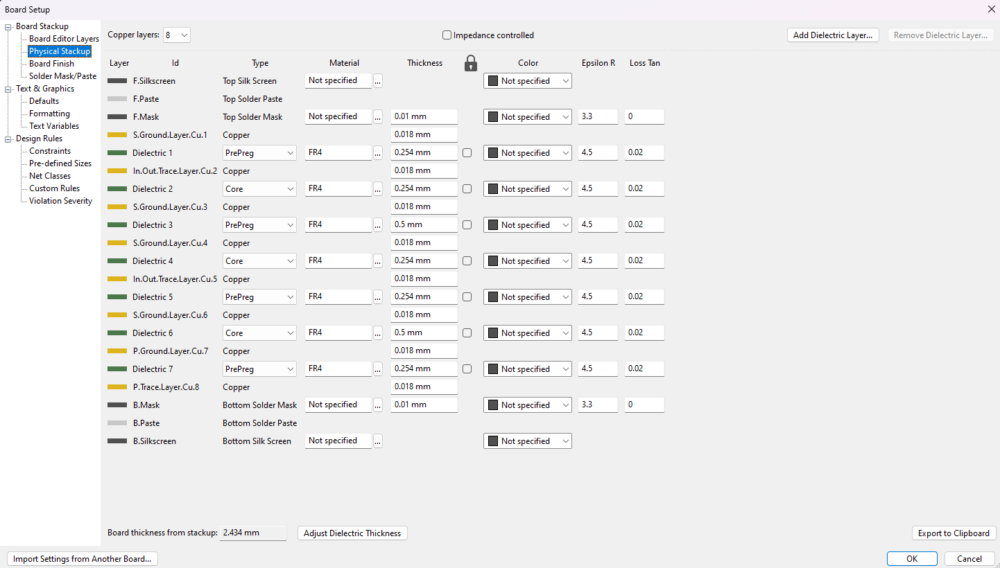  
  
### : Component List :  
: Diodes :  
[ 1N4148W ](https://www.digikey.com/en/products/detail/smc-diode-solutions/1N4148W/6022450)  
[ MMSZ5236B-7-F ](https://www.digikey.com/en/products/detail/diodes-incorporated/MMSZ5236B-7-F/717790)  
: Transistors :  
[ MMBT3904 ](https://www.digikey.com/en/products/detail/anbon-semiconductor-int-l-limited/MMBT3904/17284363)  
[ MMBT3906 ](https://www.digikey.com/en/products/detail/nte-electronics-inc/MMBT3906/11652283)  
: Capacitor :  
[ CL10A106MP8NNNC ](https://www.digikey.com/en/products/detail/samsung-electro-mechanics/CL10A106MP8NNNC/3887529)  
: Resistors :  
[ RC0402JR-071KL ](https://www.digikey.com/en/products/detail/yageo/RC0402JR-071KL/726408)  
[ RL0510S-4R7-F ](https://www.digikey.com/en/products/detail/susumu/RL0510S-4R7-F/567247)  
: Cremat Holder :   
[ SMC-1-08-1-GT ](https://www.digikey.com/en/products/detail/adam-tech/SMC-1-08-1-GT/9830825)  
: DSUB Connector :  
[50 D-Sub](https://www.digikey.com/en/products/detail/harting/09665627811/4322749)  
[9 D-Sub](https://www.digikey.com/en/products/detail/te-connectivity-amp-connectors/2311765-1/7794751)  

### : Schematic :  
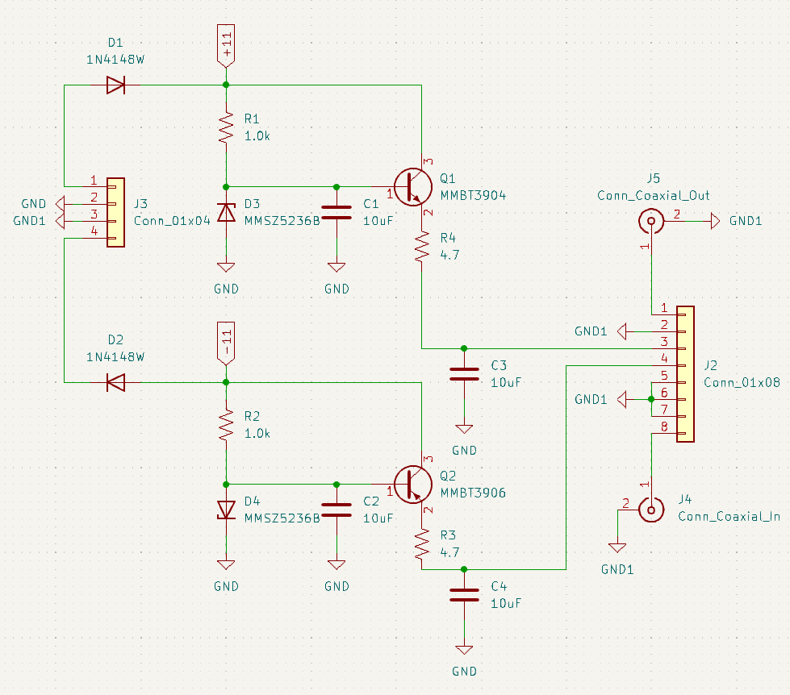  
  
### :: Test Board ::  
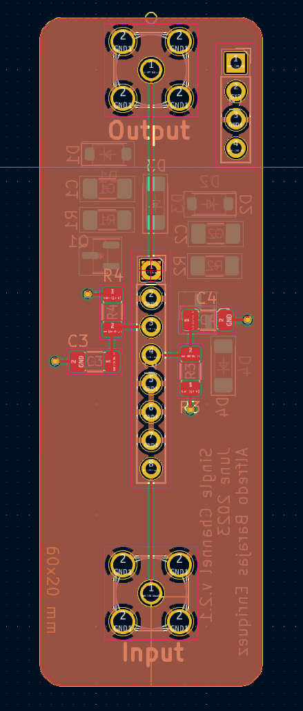 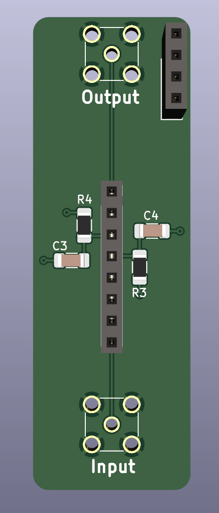 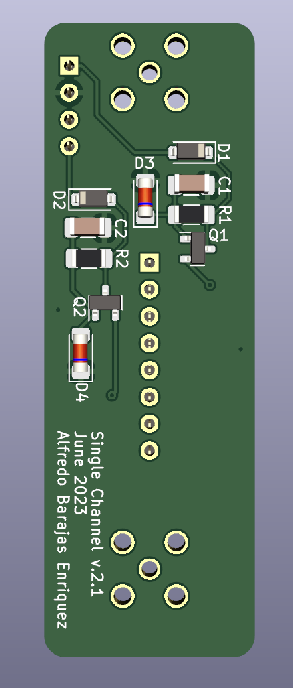  
Dimensions :  20 x 60 mm  

### :: Cell Board ::  
 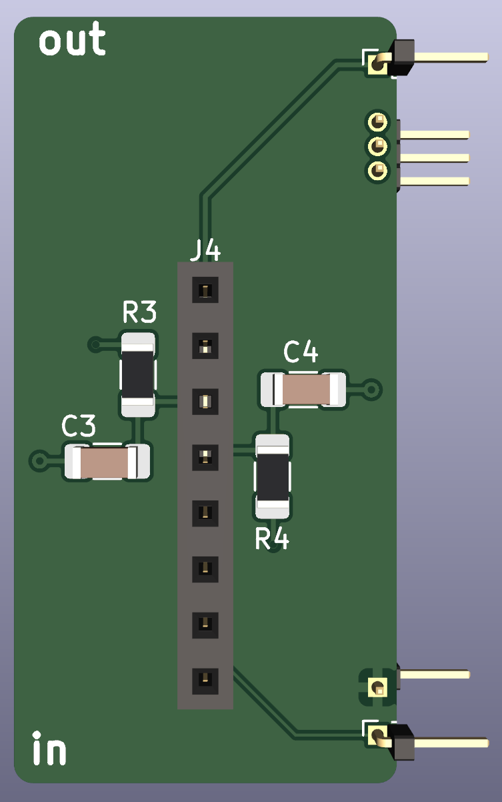 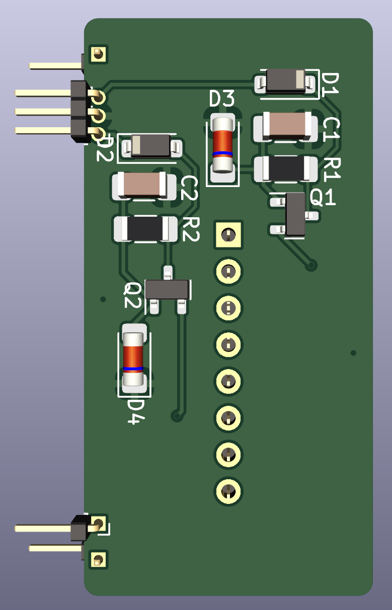  
Dimensions : 20 x 40 mm  

-------------------
## 🔲 :: 32 Cell Channel Receiver Board ::
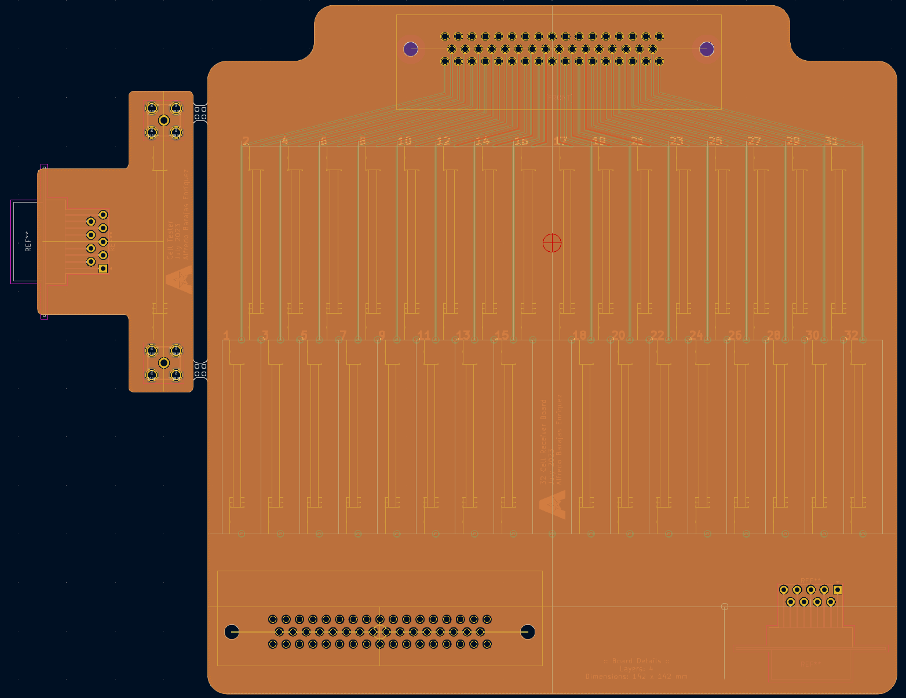  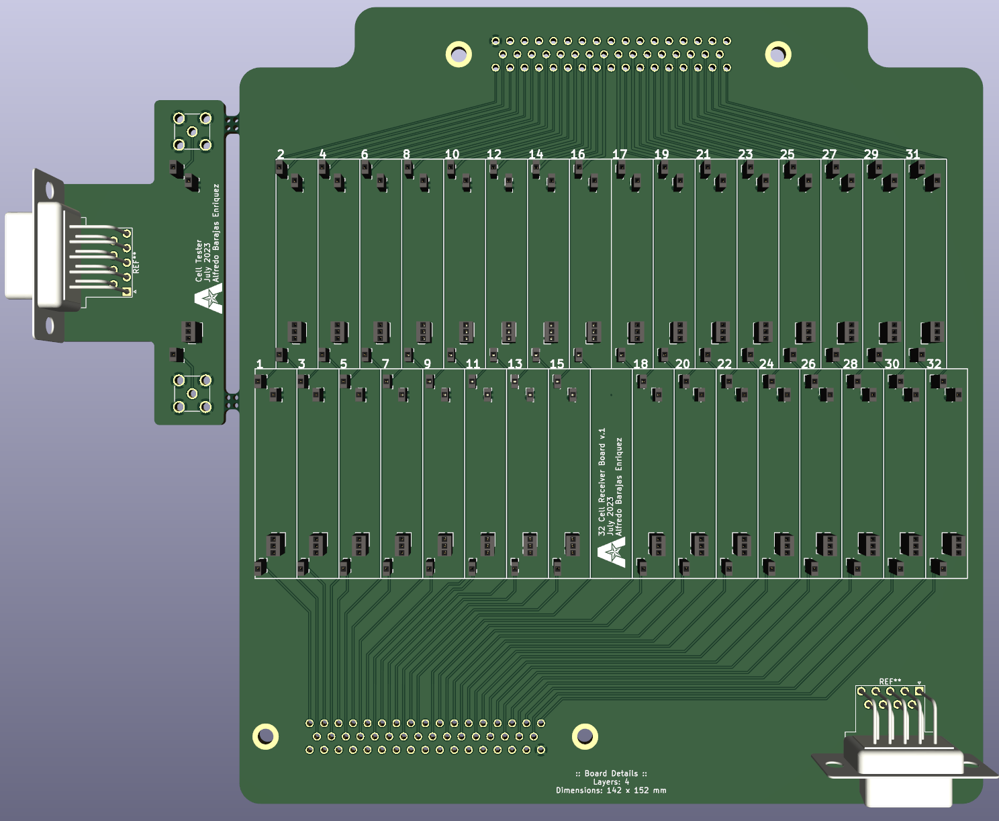   
File Dimensions : 177 x 142 mm  
  
  
### : Cell Receiver Board :  
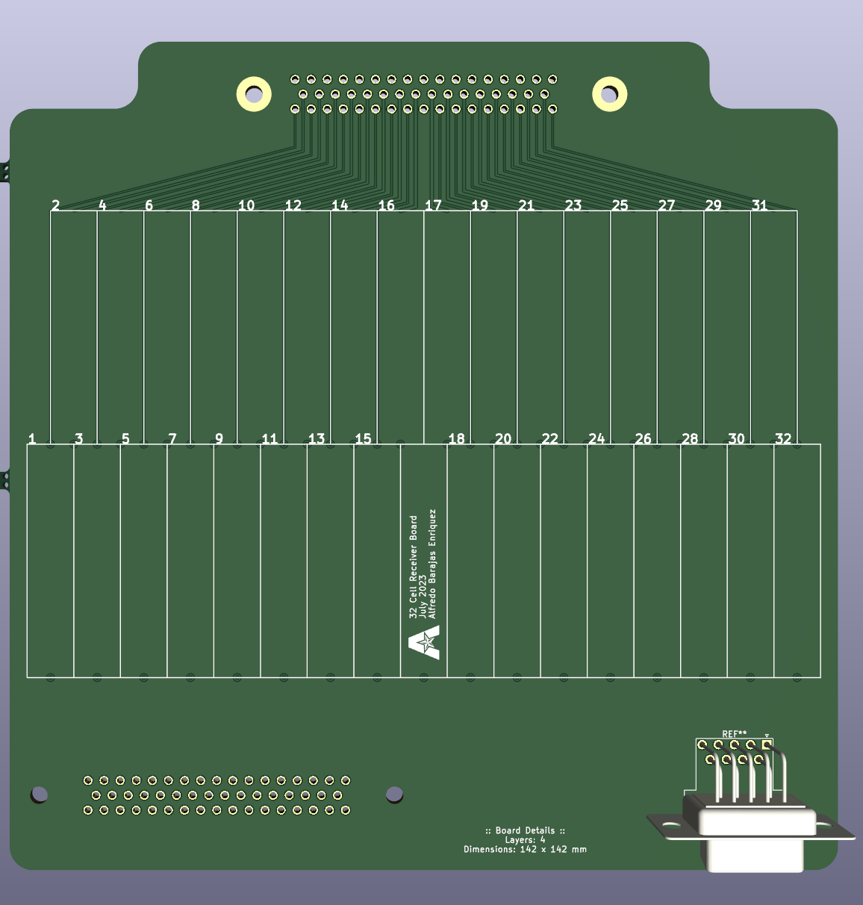   
Dimensions : 142 x 142 mm   
   
### : Cell Tester :  
Cell Tester allows for easy and quick cell testing.  
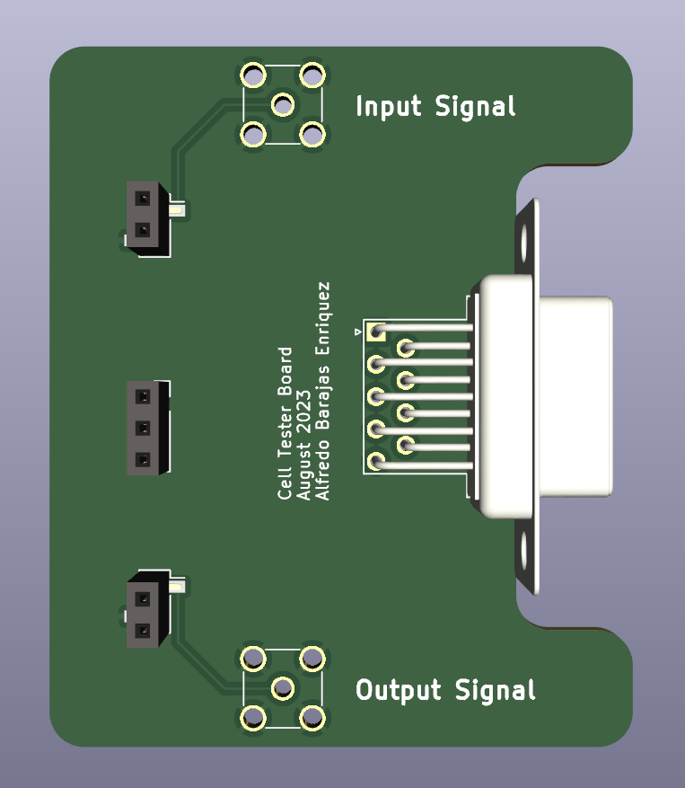  

  
### : Capacitance Fix :  
Different trace length create variances on capacitance. To correct this variance the width of each trace has been modified using the following method.  
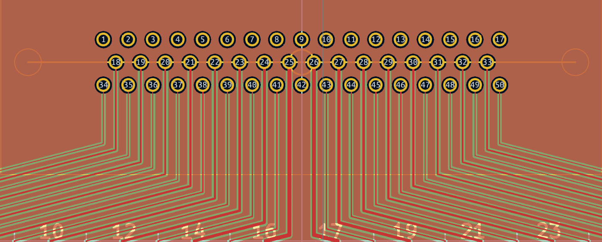  

1. The longest trace length is set to a predifined width (in this case, I have selected 0.1 mm, ***JLCPCB minimum width is 0.09 mm )  and the length is used as a base  

2. The length of another trace is then summed in a similar matter.  

3. The length of the base trace is then compared to the shorter length, such that it creates a ratio between them.  

4. This ratio is then used to multiply the base width, which will result in the width the shorter trace.  

: Excel Calculator : (Included in the Repository)    
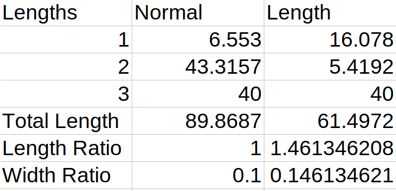    
  
## 🔲 ::: Resources :::    
:: Board Referenced ::  
[CR-150-R5](https://www.cremat.com/CR-150-R5.pdf)  
  
:: Amp Details ::  
[CREMAT CR-11X](https://www.cremat.com/CR-110-R2.1.pdf)  
  
:: Expected Connector ::  
[IFDGG501056AX](https://www.lesker.com/feedthroughs/instrument-feedthroughs-mpdt-subd/part/ifdgg501056ax)  
  
### :: Connections ::  
###[SMC-1-08-1-GT](https://www.digikey.com/en/products/detail/adam-tech/SMC-1-08-1-GT/9830825)###  
: Drawing :  
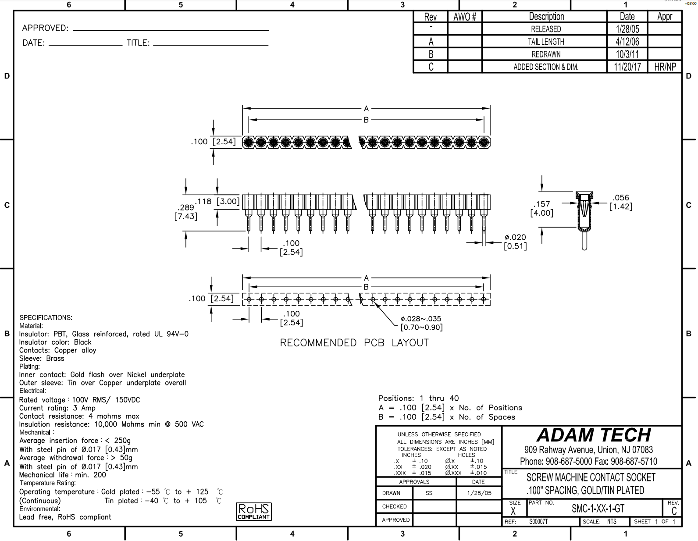  
: Generated Footprint :  
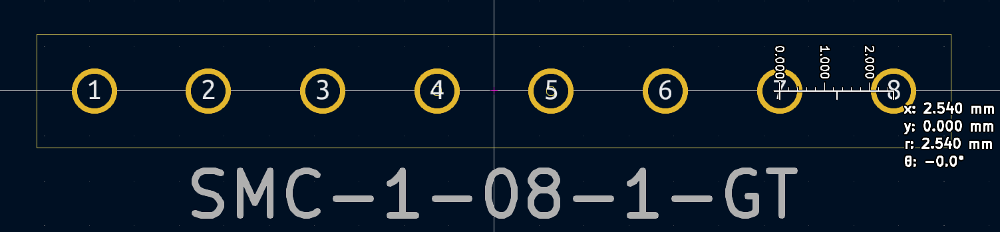  
  
###[50 Position D-Sub Plug, Male Pins Connector](https://www.digikey.com/en/products/detail/harting/09665627811/4322749)###    
: Drawing :  
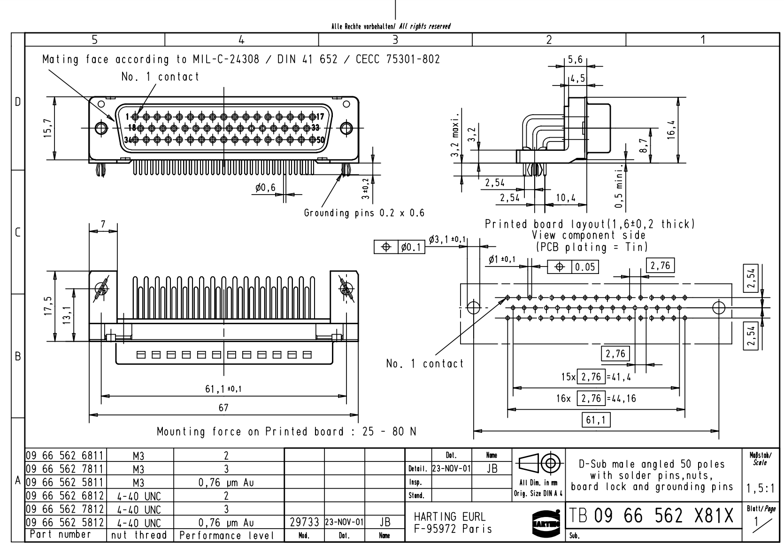  
: Generated Footprint :  
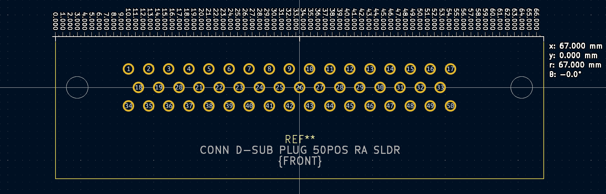  
