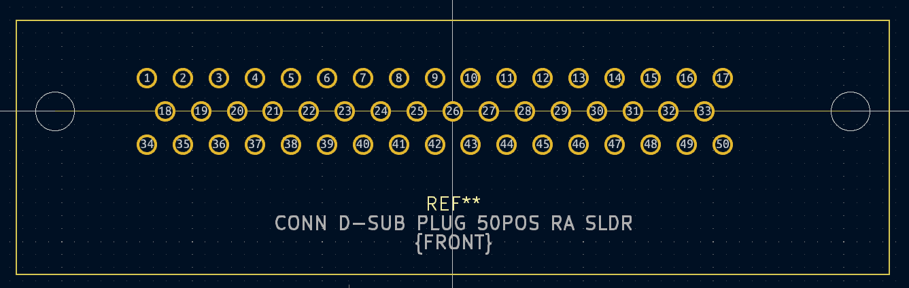

# 32.Channel.Amp
  
-----------------  
  
## ::: Resources :::
  
:: Board Referenced ::  
[CR-150-R5](https://www.cremat.com/CR-150-R5.pdf)  
  
:: Amp Details ::  
[CREMAT CR-11X](https://www.cremat.com/CR-110-R2.1.pdf)  
  
:: Expected Connector ::  
[IFDGG501056AX](https://www.lesker.com/feedthroughs/instrument-feedthroughs-mpdt-subd/part/ifdgg501056ax)  
  
### :: Connections ::  
###[SMC-1-08-1-GT](https://www.digikey.com/en/products/detail/adam-tech/SMC-1-08-1-GT/9830825)###  
: Drawing :  
  
: Generated Footprint :  
  
  
###[50 Position D-Sub Plug, Male Pins Connector](https://www.digikey.com/en/products/detail/harting/09665627811/4322749)###    
: Drawing :  
  
: Generated Footprint :  
  
