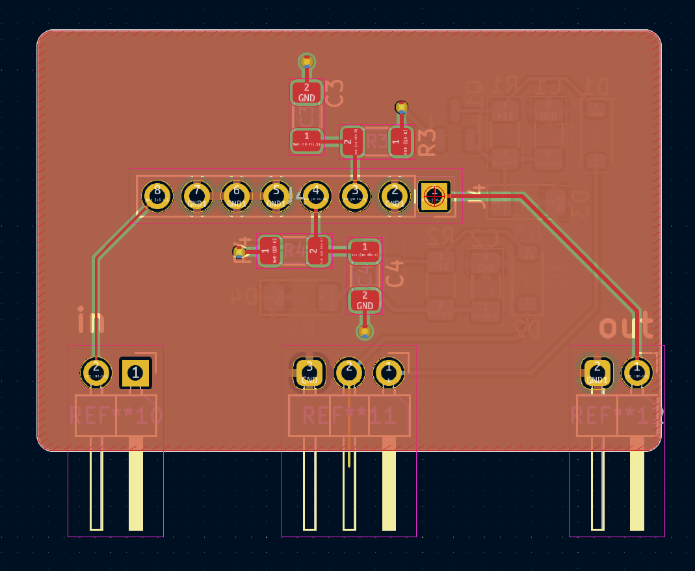
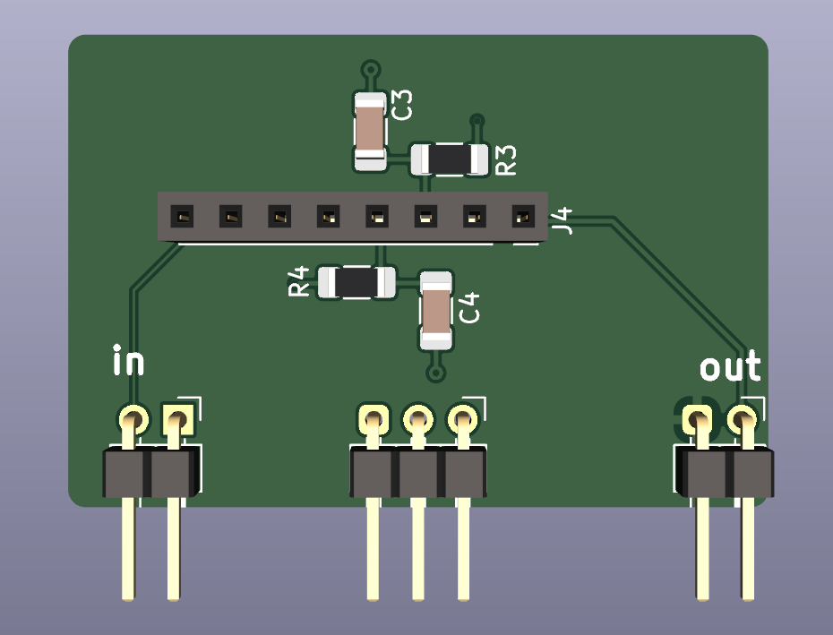
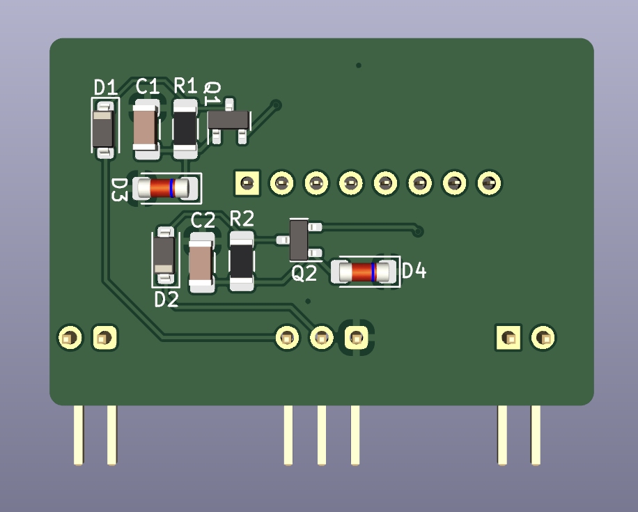
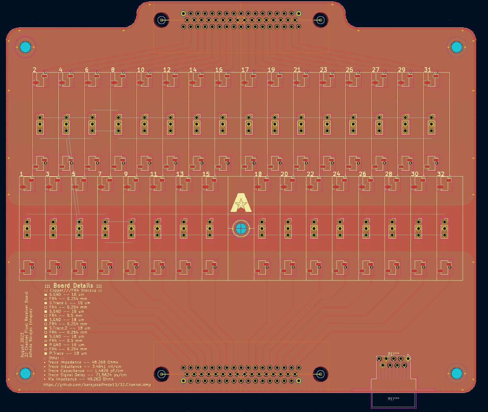
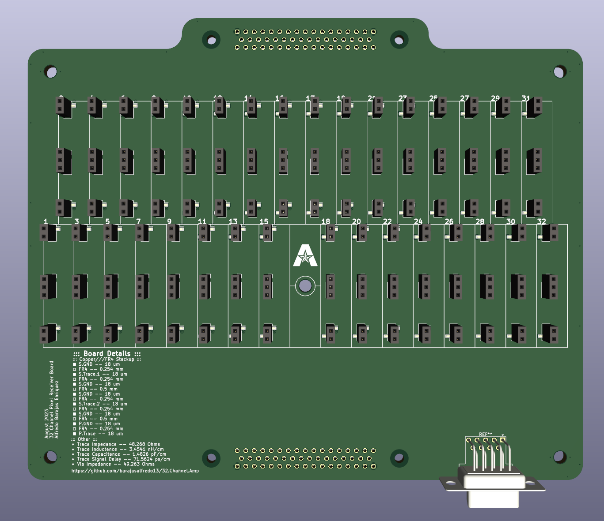

# 32.Channel.Amp
  
-----------------  
## Table of Contents
- 🔲 [Tile Boards]  
  - [Single Channel Boards]  
  - [Digi-Key Component List]
  - [Schematic]  
  - [Test Board]  
  - [Cell Board]  
- 🔲 [32 Cell Channel Receiver Board]  
  - [Cell Receiver Board]
  - [Cell Tester]
- 🔲 [Resources]  
  - [ Board Reference ]  
  - [ Amp Details ]  
  - [ Expected Connector ]  
  - [ Connections ]

----------------
## 🔲 ::: Tile Boards :::  
### :: Single Channel Boards ::  
**: Layers :** 4 Layer PCB Board  [ Power Layer , Power Ground , Signal Ground, Signal Layer ]  
  
  
### : Component List :  
: Diodes :  
[ 1N4148W ](https://www.digikey.com/en/products/detail/smc-diode-solutions/1N4148W/6022450)  
[ BZT52H-A7V5-QX ](https://www.digikey.com/en/products/detail/nexperia-usa-inc/BZT52H-A7V5-QX/17295939)  
: Transistors :  
[ MMBT3904 ](https://www.digikey.com/en/products/detail/anbon-semiconductor-int-l-limited/MMBT3904/17284363)  
[ MMBT3906 ](https://www.digikey.com/en/products/detail/nte-electronics-inc/MMBT3906/11652283)  
: Capacitor :  
[ GRM188C81C106MA73J ](https://www.digikey.com/en/products/detail/murata-electronics/GRM188C81C106MA73J/4905316)  
: Resistors :  
[ RC0402JR-071KL ](https://www.digikey.com/en/products/detail/yageo/RC0402JR-071KL/726408)  
[ 311-4.7GRCT-ND ](https://www.digikey.com/en/products/detail/yageo/RC0603JR-074R7L/726784)  
: Cremat Holder :   
[ SMC-1-08-1-GT ](https://www.digikey.com/en/products/detail/adam-tech/SMC-1-08-1-GT/9830825)  
: DSUB Connector :  
[50 D-Sub](https://www.digikey.com/en/products/detail/harting/09665627811/4322749)  
[9 D-Sub](https://www.digikey.com/en/products/detail/te-connectivity-amp-connectors/2311765-1/7794751)  

### : Schematic :  
  
  
### :: Test Board ::  
    
Dimensions :  20 x 60 mm  

### :: Cell Board ::  
    
Dimensions : 20 x 40 mm  

-------------------
## 🔲 :: 32 Cell Channel Receiver Board ::
     
  
### : Cell Receiver Board :  
   
   
### : Cell Tester :  
Cell Tester allows for easy and quick cell testing.  
  
  
## 🔲 ::: Resources :::    
:: Board Referenced ::  
[CR-150-R5](https://www.cremat.com/CR-150-R5.pdf)  
  
:: Amp Details ::  
[CREMAT CR-11X](https://www.cremat.com/CR-110-R2.1.pdf)  
  
:: Expected Connector ::  
[IFDGG501056AX](https://www.lesker.com/feedthroughs/instrument-feedthroughs-mpdt-subd/part/ifdgg501056ax)  
  
### :: Connections ::  
###[SMC-1-08-1-GT](https://www.digikey.com/en/products/detail/adam-tech/SMC-1-08-1-GT/9830825)###  
: Drawing :  
  
: Generated Footprint :  
  
  
###[50 Position D-Sub Plug, Male Pins Connector](https://www.digikey.com/en/products/detail/harting/09665627811/4322749)###    
: Drawing :  
  
: Generated Footprint :  
  
